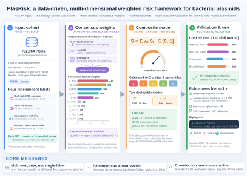

# PlasRisk

**Multi-model risk assessment for bacterial plasmids from FASTA sequences**

[](LICENSE)
[](https://python.org)
[](https://github.com/LLQ95/PlasRisk)

PlasRisk computes composite risk scores for bacterial plasmids. It accepts
plasmid FASTA sequences, automatically annotates them using
[abricate](https://github.com/tseemann/abricate), and supports **two scoring
models**:

1. **PlasRisk** (default) — a 10-dimension data-driven weighted model with a
   5-dimension lite option, optimized on 792,964 PIPdb plasmid sequence
   clusters (PSCs).
2. **PIPdb** — the original 8-item ordinal scoring system from the PIPdb paper
   (Zhu et al., *Nucleic Acids Res.*, 2025), provided for reproducibility and
   direct comparison.

PlasRisk was validated against four complementary biological outcomes that
capture distinct aspects of plasmid risk: high-risk ARG carriage (clinical
threat), MDR–virulence fusion (resistance–virulence convergence), conjugative
mobility (horizontal transmission), and biocide/metal resistance (co-selection
maintenance). The four outcomes are only weakly correlated at the replicon
level (Spearman rho from 0.01 to 0.31), so no single dimension or outcome can
substitute for the others.

<p align="center">
  <br>
  <em>Graphical abstract: FASTA input → ten sub-scores → three-method consensus weights → calibrated composite score (full-10 / lite-5) → multi-outcome validation. Editable vector source: <code>docs/graphical_abstract.svg</code>.</em>
</p>

---

## Scoring models

### PlasRisk (10-dimension weighted model)

```
Full model (10-dim):
S = 0.245*S_ARG + 0.110*S_VF + 0.204*S_MOB + 0.028*S_HOST
  + 0.003*S_REP + 0.181*S_SIZE + 0.211*S_BM
  + 0.002*S_GEO + 0.002*S_HAB + 0.015*S_GROW

Lite model (5-dim core, equivalent AUC):
S = 0.258*S_ARG + 0.115*S_VF + 0.215*S_MOB + 0.190*S_SIZE + 0.222*S_BM
```

Weights were derived by data-driven consensus (Random Forest mean decrease in
Gini, LASSO, and grid-search optimization) on 792,964 PIPdb PSCs; sum = 1.0.

Risk grades: **A** (Very High, S >= 0.60), **B** (High, >= 0.45),
**C** (Moderate, >= 0.30), **D** (Low, >= 0.15), **E** (Minimal, < 0.15).

### PIPdb (original 8-item ordinal model)

Reproduces the scoring system from PIPdb Table 1:

```
Combined risk index = Round(
    (Pathogenic_phylum + Pathogenic_species + Habitats + ARGs
     + VFGs + 2 × WHO_ARGs + ISs + Annual_average_growth_rate) / 8 + 0.6
)
```

Each item is binned into an ordinal score of 1–5; WHO-priority ARGs are
double-weighted. The combined index ranges from 1 (Minimal) to 5 (Very High).
Select with `--model pipdb` or `get_scorer('pipdb')`.

| Item | Score bins (1 → 5) |
|------|--------------------|
| Pathogenic phyla | 1, 2, 3, 4, ≥5 |
| Pathogenic species | [1,2), [2,4), [4,6), [6,8), ≥8 |
| Habitats | [1,2), [2,4), [4,6), [6,8), ≥8 |
| ARGs | 0, 1, [2,5), [5,10), ≥10 |
| VFGs | 0, 1, [2,4), [4,6), ≥6 |
| WHO ARGs (×2) | 0, 1, 2, ≥3 |
| Insertion sequences | [1,2), [2,5), [5,15), [15,30), ≥30 |
| Annual growth rate | [0,0.01), [0.01,0.05), [0.05,0.1), [0.1,0.2), ≥0.2 |

---

## Installation

### Option 1: conda (recommended)

```bash
conda create -n plasrisk -c bioconda -c conda-forge plasrisk
conda activate plasrisk
```

### Option 2: pip + manual abricate

```bash
pip install plasrisk
conda install -c bioconda abricate
```

### Option 3: from source

```bash
git clone https://github.com/LLQ95/PlasRisk.git
cd PlasRisk
pip install .
conda install -c bioconda abricate blast
```

Requires **Python 3.9+**.

---

## Quick start

```bash
# Score a single plasmid (default: PlasRisk 10-dim full model)
plasrisk plasmid.fasta

# Use the original PIPdb ordinal model
plasrisk --model pipdb plasmid.fasta

# Lite mode: 5-dimension core (ARG + VF + MOB + SIZE + BM)
plasrisk --mode lite *.fasta

# Score all FASTA files in a directory
plasrisk /path/to/plasmids/

# Specify output directory
plasrisk -o results *.fasta

# Use specific abricate databases
plasrisk --db card,vfdb,plasmidfinder,bacmet,isfinder plasmid.fasta

# Sequence-only mode (no abricate needed; uses replicon empirical priors)
plasrisk --no-abricate contigs.fasta

# JSON output
plasrisk --json -o results plasmid.fasta
```

### Model comparison

| | PlasRisk (full) | PlasRisk (lite) | PIPdb (ordinal) |
|---|---|---|---|
| Type | Continuous weighted | Continuous weighted | Ordinal bins |
| Dimensions | 10 | 5 | 8 items |
| Score range | [0, 1] | [0, 1] | 1–5 (integer) |
| Weights | Data-driven consensus | Renormalized subset | Equal (+WHO ×2) |
| WHO AWaRe weighting | Yes | Yes | WHO count only |
| Housekeeping gene exclusion | Yes | Yes | No |
| Replicon empirical fallback | Yes | Yes | N/A |
| Required annotations | ARG + VF + mobility + replicon + BacMet + metadata | ARG + VF + mobility + length + BacMet | ARG + VF + IS + metadata |
| Use case | Comprehensive One Health surveillance | Rapid screening | Reproducing PIPdb results |

### Full vs. Lite mode

Dimensionality analysis (all-subsets evaluation of 1,023 subsets with 5-fold
CV) showed that performance plateaus at k=5: adding S_VF as the 5th dimension
raises mean CV AUC from 0.918 to 0.920, and the remaining 5 context dimensions
contribute <0.1% additional AUC. The 10-dim full model is retained for
comprehensive surveillance because it is Pareto-optimal (non-dominated across
all 4 outcomes) and provides epidemiological context.

### Output files

| File | Description |
|------|-------------|
| `plasrisk_results.tsv` | Per-sequence scores: all components, S_total, S_norm, grade, gene lists |
| `plasrisk_summary.tsv` | Per-file summary: counts, grade distribution, mean/max scores |
| `plasrisk_results.json` | JSON format (with `--json`) |

When using `--model pipdb`, the output additionally includes all 8 ordinal
sub-scores (`score_phylum`, `score_species`, `score_habitats`, `score_args`,
`score_vfgs`, `score_who_args`, `score_iss`, `score_growth`) and the
`combined_risk_index` (1–5).

---

## Python API

```python
from plasrisk import get_scorer, PlasmidFeatures, annotate_fasta, load_replicon_lookup

lookup = load_replicon_lookup()
result = annotate_fasta("plasmid.fasta", lookup=lookup)

# PlasRisk 10-dim model (default)
scorer = get_scorer("plasrisk")
df = scorer.score_dataframe(result.features)

# PlasRisk lite 5-dim model
scorer_lite = get_scorer("plasrisk", mode="lite")
df_lite = scorer_lite.score_dataframe(result.features)

# Original PIPdb ordinal model
pipdb = get_scorer("pipdb")
df_pipdb = pipdb.score_dataframe(result.features)

# Direct class access also works
from plasrisk import PlasRiskScorer, PIPdbScorer
```

---

## The risk dimensions (PlasRisk)

| Component | Weight (full/lite) | What it measures |
|-----------|--------------------|------------------|
| **S_ARG** | 0.245 / 0.258 | ARG count with WHO AWaRe hazard weighting, high-risk genes (mcr, NDM, KPC, CTX-M, tetX), last-resort multipliers |
| **S_BM** | 0.211 / 0.222 | Biocide/metal resistance (mer, qac, ars/cop/sil) — co-selection potential; CARD fallback when BacMet unavailable |
| **S_MOB** | 0.204 / 0.215 | T4CP, relaxase, oriT, auxiliary transfer proteins, integrons, IS density |
| **S_SIZE** | 0.181 / 0.190 | Plasmid length (cargo capacity), sigmoid midpoint 30 kb |
| **S_VF** | 0.110 / 0.115 | VF count, exotoxins, secretion systems (T3SS/T4SS) |
| **S_HOST** | 0.028 / — | Host range breadth |
| **S_GROW** | 0.015 / — | Annual growth rate of the replicon |
| **S_REP** | 0.003 / — | Replicon backbone risk prior |
| **S_HAB** | 0.002 / — | Habitat breadth (human/animal/environment) |
| **S_GEO** | 0.002 / — | Geographic spread |

### Robustness features (v1.1.0)

- **Replicon empirical fallback**: When sequence-derived dimensions (S_MOB,
  S_HOST, S_GEO, S_HAB, S_GROW, S_REP) cannot be computed — e.g., abricate
  does not detect mobility genes or metadata is unavailable — replicon-specific
  median values from 792,964 PIPdb PSCs are used as priors. Multi-replicon
  plasmids (e.g., IncFII;IncFIA;IncR) take the maximum prior across replicons.
- **Housekeeping gene exclusion**: Chromosomal efflux pumps and porins
  (acrAB, tolC, mexAB-oprM, etc.) annotated by CARD are excluded from S_ARG
  to avoid inflating scores with non-transferred determinants.
- **Sigmoid S_SIZE**: Logistic function on log10(length) centered at 30 kb
  replaces the linear cap, better separating small mobilizable plasmids from
  large conjugative ones.
- **Additive S_MOB**: Mobility class base + integron bonus + IS density bonus
  (up to +0.30), with ISfinder/Tn database support.
- **CARD biocide/metal fallback**: When BacMet database is unavailable,
  S_BM detects biocide/metal genes from CARD annotations.

---

## Four complementary risk outcomes

Weights and validation targets were defined from four binary outcomes chosen
to cover separate stages of plasmid-mediated risk. Their natural prevalence
in PIPdb differs by more than tenfold:

| Outcome | Definition | Prevalence |
|---------|-----------|------------|
| High-risk ARG | At least one critically important ARG (carbapenemase, mcr, etc.) | 3.1% |
| MDR–VF fusion | At least one ARG and one virulence factor on the same plasmid | 1.8% |
| Conjugative mobility | Complete conjugative transfer machinery | 5.1% |
| Biocide/metal resistance | At least one biocide/metal resistance gene | 34.0% |

The outcomes overlap non-randomly (60.3% of ARG-carrying plasmids also carry
BMGs; OR = 3.82) but remain biologically distinct: conjugative rate was
essentially uncorrelated with high-risk ARG carriage across replicons
(Spearman rho = 0.01), and the backbones with the highest high-risk ARG rates
(ColKP3 82.5%, Col3M 48.3%) are small and largely non-conjugative, whereas the
most conjugative families (IncN2 88.1%, IncFII variants 42–56%) rarely carry
critical ARGs. IncN2 and IncN are exceptions combining both properties.

---

## Model validation

### Internal validation (792,964 PIPdb PSCs)

| Outcome | AUC (PlasRisk) | AUC (PIPdb) |
|---------|---------------|-------------|
| High-risk ARG carriage | 0.958 | 0.966 |
| MDR–VF fusion | 0.964 | 0.940 |
| Conjugation potential | 0.856 | — |
| Biocide/metal resistance | 0.903 | — |
| **Mean (4 outcomes)** | **0.920** | — |

- **Dimensionality analysis**: 5-dim lite achieves equivalent mean AUC to
  10-dim full (0.920 vs. 0.920); no overfitting (train-test gap < 0.003,
  bootstrap optimism < 0.005).
- **LORO-CV**: mean AUC = 0.962 across 40 replicons.
- **Weight sensitivity** (100 iterations, ±30%): Spearman rho = 0.994, top-10
  overlap = 9.5/10.
- **Natural-prevalence calibration** (~3.1% high-risk): Grade A plasmids had
  a 46.1% observed high-risk rate versus the 3.1% baseline (positive likelihood
  ratio 27.2), while Grades D/E contained no high-risk plasmids.
- **Temporal split validation**: train on pre-2020 PSCs (n = 722,350), test on
  2020+ PSCs (n = 70,614); stable discrimination (mean AUC 0.924 vs. 0.916)
  with no performance decay.

### External validation

367 independently curated NCBI plasmids absent from PIPdb (167 carrying
critical ARGs such as blaNDM, blaKPC, and mcr; 200 small ARG/VF-free plasmids),
all verified as true plasmid sequences (<500 kb, no chromosomal contamination).
Labels were assigned by abricate annotation rather than sequence titles.
PlasRisk achieved ROC-AUC = 0.998 (95% CI 0.994–1.000), with sensitivity 0.994
and specificity 0.960 at S >= 0.30; dimensions that cannot be annotated from a
standalone FASTA are imputed from replicon empirical medians.

---

## Reproducibility

The complete data-driven analysis and manuscript figures are reproducible from
the [`scripts/`](scripts/) directory. The `pipdb_*.R/.py` pipeline rebuilds
all result tables from PIPdb metadata, and `fig2_weight_validation.R` through
`fig11_conjugative_replicon.R` generate manuscript Figures 2–11 (run as
`Rscript figN_*.R results`; figures are written to `results/figures/`). The
figure scripts are pure-ASCII and tested on R 4.1.x, using the `maps`
package for world maps so that older R installations do not require `sf` or
`scatterpie`.

```bash
python -m pytest tests/ -v          # PlasRisk core tests
python test_pipdb_model.py          # PIPdb model tests (8/8)
```

## Changelog

### v1.1.0

- Added `PIPdbScorer` class implementing the original PIPdb 8-item ordinal
  model (Table 1 formula), selectable via `--model pipdb` or
  `get_scorer('pipdb')`.
- Added `get_scorer()` factory function for model selection.
- Fixed S_MOB/S_HOST/S_GEO/S_HAB/S_GROW fallback to replicon empirical medians
  when abricate does not detect genes.
- Added multi-replicon support in prior lookup (max across replicons).
- Added housekeeping chromosomal gene exclusion from S_ARG (acrAB, tolC, etc.).
- Changed S_SIZE to sigmoid (logistic, midpoint 30 kb).
- Changed S_MOB to additive formula (class base + integron + IS density).
- Added CARD-based biocide/metal fallback when BacMet is unavailable.
- Added ISfinder and Tn transposon database support.
- Added `n_pathogenic_phylum`, `n_pathogenic_species` fields and `n_who_arg`
  property to `PlasmidFeatures`.
- Fixed data.table compatibility issues in external validation pipeline.

### v1.0.0

- Initial release: 10-dimension weighted model with 5-dim lite option.

## Citation

> Li L, Wu Y. PlasRisk: a multi-dimensional data-driven weighted risk
> assessment framework for bacterial plasmids. Manuscript in preparation, 2026.

Based on data from:
> Zhu Q, Chen Q, Lu X, et al. PIPdb: a comprehensive plasmid sequence resource
> for tracking the horizontal transfer of pathogenic factors and antimicrobial
> resistance genes. *Nucleic Acids Research*, 2025, 53(D1):D169-D178.
> doi:10.1093/nar/gkae952

## License

MIT License - see [LICENSE](LICENSE).
